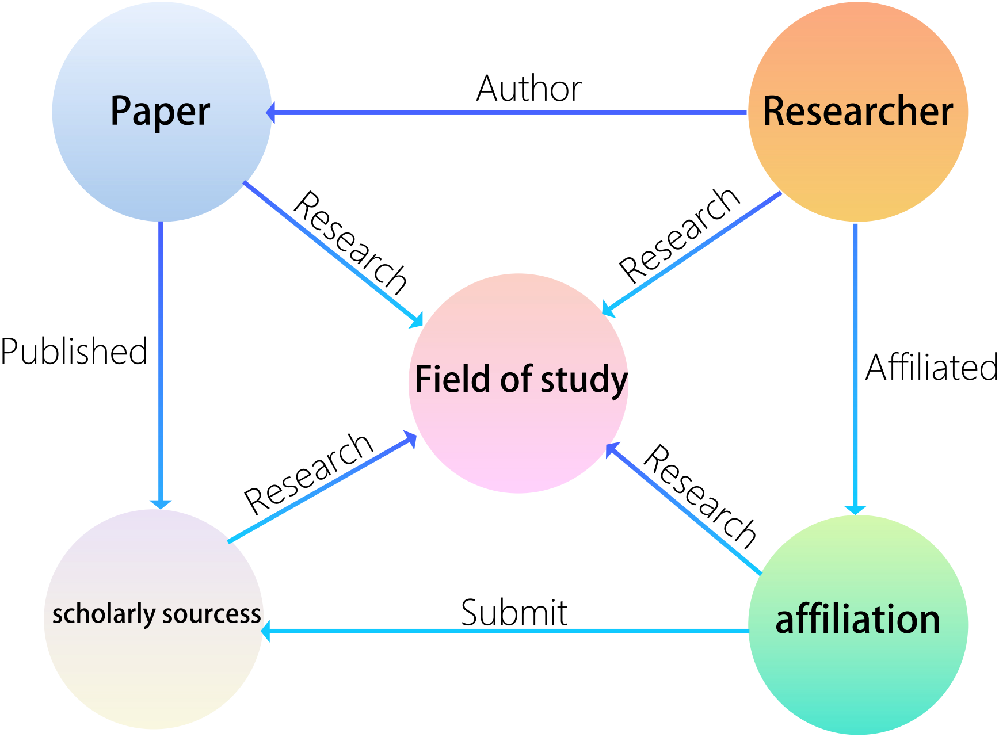
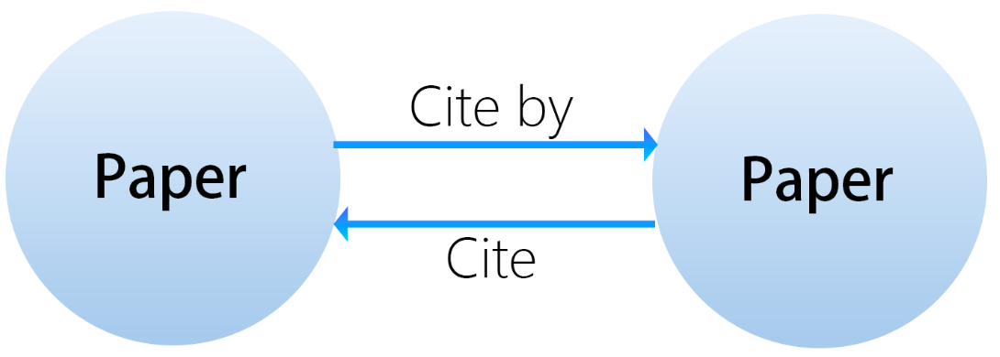
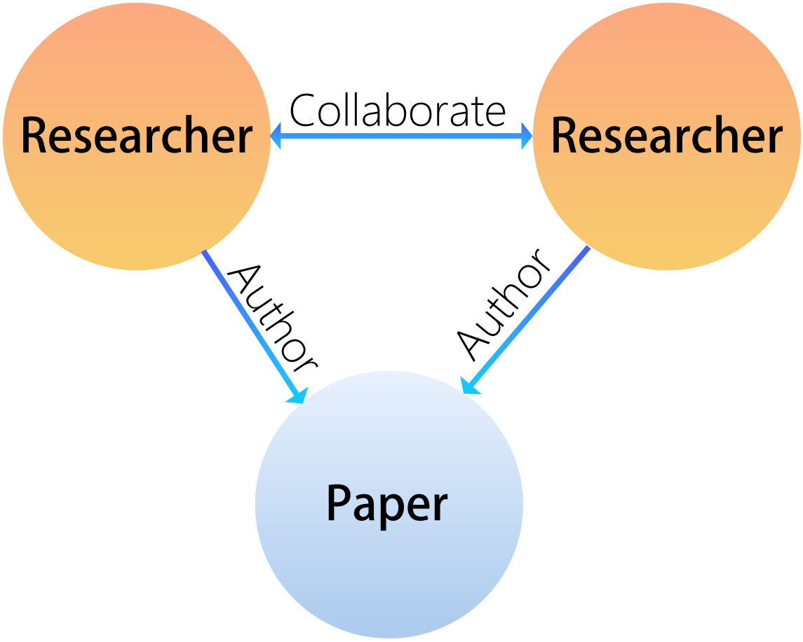

# 实体标准

我们使用知识图谱来存储和管理学术资源

## 不同实体间关系

_在此图中，圆形代表实体_

| 实体        | 解释                                       |
|-------------|--------------------------------------------|
| Paper        | 对应论文                                   |
| Researcher      | 学术研究者(个人)                            |
| affiliation     | 进行科学研究的相关机构                      |
| scholarly sourcess       | 期刊、会议、或网站                          |
|Field of study    |研究领域  

此图展示了不同实体之间可存在的关系，我们可以将此图视为以一篇论文为中心的最小整体

## 相同实体关系

论文之间的关系有"引用"和"被引用"，我们可以用引用关系铺开一整张知识图谱网络

研究者之间的关系，对于共同撰写同一论文的作者，我们可以确定他们有"合作"关系

学术来源之间的关系，对于研究领域相同的期刊和会议，它们有"同领域"关系

## 属性

目前对于这五个不同的实体，有以下的属性

### 论文属性
|Attribute          | File Type      | Description                                         | Example                                 |
|-----------------------|----------------|-----------------------------------------------------|-----------------------------------------|
| Title                 | String         | 论文标题                                             | "Deep Learning for Natural Language Processing" |
| Abstract              | String           | 论文简介                                             | "This paper explores various deep learning models..." |
| Source                | String         | 论文来源或出版商                                       | "IEEE Transactions on Neural Networks"   |
| CitationCount        | Integer        | 论文被引用次数                                         | 150                                     |
| CitedBy              | Integer        | 论文引用其他文献的数量                                   | 30                                      |
| PublicationDate      | String           | 论文发表日期                                          | 2021-06-15                              |
| JournalIssue         | String         | 论文发表的期刊和期号                                    | "Vol. 29, No. 5"                        |
| OriginalTextLink    | String            | 原文链接，适应不同版本                                    | "https://www.examplejournal.org/article12345" |
| ReadpaperReadingLink| String            | 在Readpaper平台上阅读论文的链接                           | "https://readpaper.com/pdf-annotate/note?pdfId=1234"      |
| CitationFormat       | String           | 论文引用格式的详细描述                                   | "APA, MLA, Chicago styles"              |
| InclusionStatus      | String         | 论文在数据库中的收录状态                                   | "SCI, EI Indexed"                       |
| JCR_Division          | String         | 期刊引用报告的分区                                        | "Q1"                                    |
| Impact_Factor         | Float          | 期刊的影响因子                                           | 7.89                                    |

### 研究者属性
| Attribute          | File Type | Description                                                             | Example                                                |
|-----------------------|-----------|-------------------------------------------------------------------------|--------------------------------------------------------|
| ProfilePage          | String    | 读Paper平台上研究者的个人资料页面链接                                    | "https://readpaper.com/author/1234"                |
| ProfilePicture       | String    | 研究者个人资料图片的链接                                                 | "https://example.com/profile_picture.jpg"              |
| Name                  | String    | 研究者的全名                                                             | "Dr. Jane Doe"                                         |
| TotalWorks           | Integer    | 研究者发表的作品总数                                                      | 35                                                   |
| Email                 | String    | 研究者的联系邮箱                                                          | "jane.doe@example.com"                                 |
| TotalCitations       | Integer    | 研究者作品被引用的总次数                                                  | 1200                                                 |
| ResearchFields       | String    | 研究者的研究领域                                                         | "Machine Learning, Computational Linguistics, Data Privacy" |
| PersonalSummary      | String    | 研究者的简短个人简历或学术重点描述                                        | "Dr. Jane Doe has been a leading figure in computational linguistics..." |
| EducationBackground  | String    | 研究者的教育背景，包括学位和就读学校                                      | "Ph.D. in Computer Science, MIT"                        |
| WorkExperience       | String    | 研究者的工作经历                                                         | "Senior Research Scientist at Google AI, previously professor at Stanford University" |

### 学术来源属性
| Attribute      | File Type | Description                                                     | Example                                |
|-------------------|-----------|-----------------------------------------------------------------|----------------------------------------|
| ResearchFields   | String    | 出版商涵盖的主要研究领域                                          | "Computer Science, Artificial Intelligence" |
| Year              | Integer    | 建立年份或相关的年份                                             | 1997                                 |
| Website           | String    | 出版商官方网站的链接                                             | "https://www.examplepublisher.com"     |
| Name              | String    | 出版商的名称                                                     | "Springer"                             |
| ImpactFactor     | Float    | 期刊的影响因子（如果适用）                                        | 5.312                                |
| Type              | String    | 出版商的类别：期刊、会议或网站                                    | "Journal"                              |

### 机构属性
| Attribute      | File Type | Description                                                  | Example                                   |
|-------------------|-----------|--------------------------------------------------------------|-------------------------------------------|
| Name              | String    | 研究机构的官方名称                                            | "Massachusetts Institute of Technology"   |
| Location          | String    | 研究机构的地理位置                                            | "Cambridge, Massachusetts, USA"           |
| ResearchFields   | String    | 研究机构的主要研究领域                                        | "Computer Science, Biology, Engineering"  |
| InstitutionType  | String    | 研究机构的类型：商业公司或学校                                | "School"                                  |

### 研究领域属性
| Attribute                    | Type    | Description                                         | Example                                   |
|------------------------------|---------|-----------------------------------------------------|-------------------------------------------|
| Name                         | String  | 研究领域的正式名称                                    | "Artificial Intelligence"                 |
| Description                  | String  | 研究领域的简要概述或总结                              | "研究算法如何通过经验自我改进的学科。"       |
| Keywords                     | String  | 与该领域相关的关键词                                  | "Machine learning, neural networks, deep learning" |
| Main Research Questions      | String  | 该领域内的核心问题或关注点                            | "How can machines learn from data?"       |
| Theoretical Basis            | String  | 该领域的核心理论或模型                                | "Statistical learning theory"             |
| Methodologies                | String  | 该领域使用的常见研究方法或技术                        | "Supervised learning, unsupervised learning" |
| Leading Scholars             | String  | 该领域的杰出研究者或学者                              | "Andrew Ng, Geoffrey Hinton"              |
| Key Publications             | String  | 该领域内重要的书籍、论文或期刊                        | "Journal of Machine Learning Research"    |
| Related Disciplines          | String  | 与该学科相关的其他学科                                | "Statistics, computer science, cognitive science" |
| Main Research Institutions   | String  | 专注于该领域的主要大学或机构                          | "Stanford University, MIT"                |
