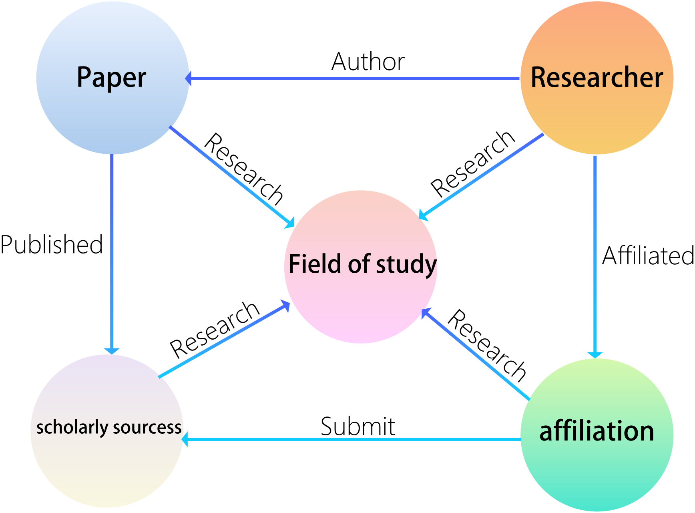
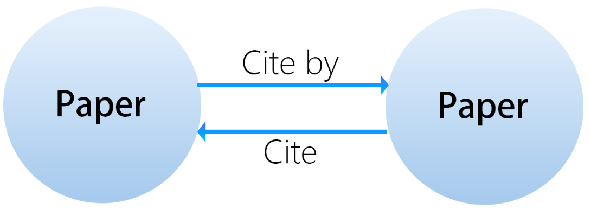

# Entity Standards

We use a knowledge graph to store and manage academic resources.

## Relationships Between Different Entities

_In this diagram, circles represent entities ._

| Entity       | Description                               |
|--------------|-------------------------------------------|
| Paper        | Corresponds to a specific academic paper. |
| Researcher   | Individual academic researchers.          |
| Affiliation | Organizations involved in scientific research. |
| Scholarly sourcess    | Journals, conferences, or websites.       |
|Field of Study |	Specific area of academic research or expertise.|

This diagram shows the possible relationships between different entities, with a paper as the central focus of the minimal whole.

## Relationships Among Same Entities

Relationships between papers include "cites" and "is cited by", which can expand into an entire knowledge graph network.

Relationships between researchers, for co-authors of the same paper, can be identified as "collaborators".

Relationships between scholarly sourcess, for journals and conferences in the same research field, can be identified as "Co field".

Relationships between field of Study,if the fields are related, we mark the relationship as "related"

if two fields have a hierarchical relationship, we use the term 'Branch of' to describe the relationship
## Attributes

Currently, there are the following attributes for these four different entities:

### Paper Attributes
|Attribute          | File Type      | Description                                         | Example                                 |
|-----------------------|----------------|-----------------------------------------------------|-----------------------------------------|
| Title                 | String         | The title of the paper                              | "Deep Learning for Natural Language Processing" |
| Abstract              | String           | A brief summary of the paper                        | "This paper explores various deep learning models..." |
| Source                | String         | The origin or the publisher of the paper            | "IEEE Transactions on Neural Networks"   |
| CitationCount        | Integer        | The number of times the paper has been cited        | 150                                     |
| CitedBy              | Integer        | Number of references within the paper               | 30                                      |
| PublicationDate      | String           | The date when the paper was published               | 2021-06-15                              |
| JournalIssue         | String         | The issue of the journal in which the paper appeared| "Vol. 29, No. 5"                        |
| OriginalTextLink    | String            | Link to the original paper, adaptable for versions  | "https://www.examplejournal.org/article12345" |
| ReadpaperReadingLink| Class            | Links to read the paper on Readpaper platform        | "https://readpaper.com/pdf-annotate/note?pdfId=1234"      |
| CitationFormat       | String           | Various citation formats as detailed on Readpaper   | "APA, MLA, Chicago styles"              |
| InclusionStatus      | String         | Status of the paper’s inclusion in databases        | "SCI, EI Indexed"                       |
| JCR_Division          | String         | Journal Citation Reports division                   | "Q1"                                    |
| Impact_Factor         | Float          | The impact factor of the journal                    | 7.89                                    |
| DOI | String | The Digital Object Identifier of the paper | "10.1000/xyz123" |
| Keywords | String | Key terms associated with the paper | "machine learning, natural language processing, neural networks" | 
| FundingInformation | String | Details of financial support for the research | "Funded by the National Science Foundation under grant no. XYZ1234" | 
| AcceptanceDate | String | The date when the paper was accepted by the journal | "2021-05-10" |
| ArticleType | String | The type of the paper, e.g., review, research, etc. | "Research Article" | 
| PeerReviewStatus | String | The status of the peer review process | "Double-blind peer reviewed" |

### Researcher Attributes
| Attribute          | File Type | Description                                                             | Example                                                |
|-----------------------|-----------|-------------------------------------------------------------------------|--------------------------------------------------------|
| ProfilePage          | String    | Default personal profile page URL on the ReadPaper platform             | "https://readpaper.com/author/1234"                |
| ProfilePicture       | String    | URL for the researcher's profile picture                                | "https://example.com/profile_picture.jpg"              |
| Name                  | String    | Full name of the researcher                                             | "Dr. Jane Doe"                                         |
| TotalWorks           | Integer    | Total number of published works as a string                             | 35                                                   |
| Email                 | String    | Contact email address as a string                                       | "jane.doe@example.com"                                 |
| TotalCitations       | Integer    | Total number of times the researcher's works have been cited as a string| 1200                                                 |
| ResearchFields       | String    | Areas of research expertise listed as a string                          | "Machine Learning, Computational Linguistics, Data Privacy" |
| PersonalSummary      | String    | Brief biography or summary of academic focus                            | "Dr. Jane Doe has been a leading figure in computational linguistics..." |
| EducationBackground  | String    | Educational history including degrees and institutions                  | "Ph.D. in Computer Science, MIT"                        |
| WorkExperience       | String    | Summary of past and current positions as a string                       | "Senior Research Scientist at Google AI, previously professor at Stanford University" |
| SocialMediaLinks | String | Links to the researcher's social media profiles | "Twitter: @DrJaneDoe, LinkedIn: linkedin.com/in/janedoe" | 
| OfficeAddress | String | Physical location of the researcher's office | "Room 404, Science Building, Stanford University" |
| ResearchGroup | String | Name and link to the researcher's research group or lab | "Machine Learning Lab, https://mlab.stanford.edu" |
| AcademicAwards | String | Academic awards or honors the researcher has received | "ACM Fellow, IEEE Best Paper Award" |
| AcademicService | String | Service roles the researcher has in academic journals or conferences | "Editor for Nature Machine Intelligence, Chair for NeurIPS 2023" |
| Patents | String | Patents that the researcher holds or co-holds | "US9876543 - Methods of improving neural network efficiency" | 
| Lectures | String | Important lectures or talks given by the researcher | "Keynote Speech at ICCV 2021" | 
| ResearchGrants | String | Grants received by the researcher for ongoing or completed research | "NSF Grant #123456 for Research on AI Ethics" | 
| AcademicInterests | String | Specific academic interests of the researcher | "Deep Learning, Ethical AI, Data Security" |

###  Scholarly sourcess Attributes
| Attribute      | File Type | Description                                                     | Example                                |
|-------------------|-----------|-----------------------------------------------------------------|----------------------------------------|
| ResearchFields   | String    | Primary research areas covered by the publisher                 | "Computer Science, Artificial Intelligence" |
| Year              | Integer    | The year of establishment or the year relevant to the context    | 1997                                 |
| Website           | String    | URL of the publisher's official website                         | "https://www.examplepublisher.com"     |
| Name              | String    | Name of the publisher                                           | "Springer"                             |
| ImpactFactor     | Float    | Journal's impact factor if applicable                           | 5.312                                |
| Type              | String    | The category of the publisher: journal, conference, or website  | "Journal"                              |
| EditorialOfficeAddress | String | Address of the journal or conference editorial office | "1234 Journal St, Cambridge, MA 02139" | 
| ISSNNumber | String | International Standard Serial Number for the journal | "1234-5678" | 
| ConferenceLocation | String | Specific location where the conference is held | "Las Vegas Convention Center, Las Vegas, NV" | 
| ConferenceDates | String | Dates during which the conference takes place | "2024-09-10 to 2024-09-13" | 
| AcceptedPaperTypes | String | Types of papers accepted by the journal or conference | "Full papers, Abstracts, Poster presentations" | 
| ReviewPeriod | String | Average time from paper submission to acceptance notification | "3 months" | 
| Organizers | String | Organizations that host the journal or conference | "IEEE" | 
| KeynoteSpeakers | String | Keynote speakers at the conference | "Dr. John Smith, Prof. Alice Johnson" | 
| SubmissionDeadline | String | Deadline for paper submissions | "2024-05-01" | 
| ConferenceFrequency | String | Frequency of the conference | "Annually" |

### Affiliation Attributes
| Attribute      | File Type | Description                                                  | Example                                   |
|-------------------|-----------|--------------------------------------------------------------|-------------------------------------------|
| Name              | String    | The official name of the Affiliation                | "Massachusetts Institute of Technology"   |
| Location          | String    | Geographic location of the Affiliation                       | "Cambridge, Massachusetts, USA"           |
| ResearchFields   | String    | Primary areas of research focus                              | "Computer Science, Biology, Engineering"  |
| InstitutionType  | String    | Nature of the affiliation: commercial company or school      | "School"                                  |
| EstablishedYear       | Integer     | Year when the institution was established                         | 1861                                                   |
| NumberOfStudents      | Integer     | Total number of students enrolled                                 | 11000                                                  |
| AcademicStaff         | Integer     | Number of academic staff members                                  | 1000                                                   |
| CampusArea            | String      | Size or description of the campus area                            | "168 acres"                                            |
| Website               | String      | URL of the institution's official website                         | "https://www.mit.edu"                                  |
| Accreditation         | String      | Accreditation status and accrediting organization                 | "Regionally accredited by the New England Commission"  |
| Ranking               | String      | Academic ranking or position in global or national lists          | "Ranked #1 in Engineering globally by QS World Rankings"|
| LibrarySize           | String      | Description or size of the institution's library collections      | "Over 3 million volumes"                               |
| AlumniNetworkSize     | Integer     | Number of registered members in the institution’s alumni network  | 130000                                                 |
| InternationalStudents | String      | Percentage or number of international students                    | "10,000 students or 30%"                               |

### Field of Study Attributes

| Attribute             | Type    | Description                                         | Example                                   |
|-----------------------|---------|-----------------------------------------------------|-------------------------------------------|
| Name                  | String  | The official name of the Research Field             | "Artificial Intelligence"                 |
| Description           | String  | Brief overview or summary of the research field     | "Study of algorithms that automatically improve through experience." |
| Keywords              | String  | Key terms associated with the field                 | "Machine learning, neural networks, deep learning" |
| Main Research Questions | String | Core questions or focus areas within the field       | "How can machines learn from data?"       |
| Theoretical Basis     | String  | Core theories or models in the field                | "Statistical learning theory"             |
| Methodologies         | String  | Common research methods or techniques used          | "Supervised learning, unsupervised learning" |
| Leading Scholars      | String  | Prominent researchers or scholars in the field      | "Andrew Ng, Geoffrey Hinton"              |
| Key Publications      | String  | Important books, papers, or journals in the field   | "Journal of Machine Learning Research"    |
| Related Disciplines   | String  | Other academic disciplines related to the field     | "Statistics, computer science, cognitive science" |
| Main Research Institutions | String | Major universities or institutions focusing on the field | "Stanford University, MIT"              |

### Public Attributes
| Attribute             | Type    | Description                                         | Example                                   |
|-----------------------|---------|-----------------------------------------------------|-------------------------------------------|
| ID | Integer | Unique identifier for each record in the database | 12345 |
| DeletionMark | Boolean | Indicator whether the record is marked for deletion | false | 
| EntryDate | DateTime | Timestamp when the record was entered into the database | "2024-09-12T14:00:00Z" |